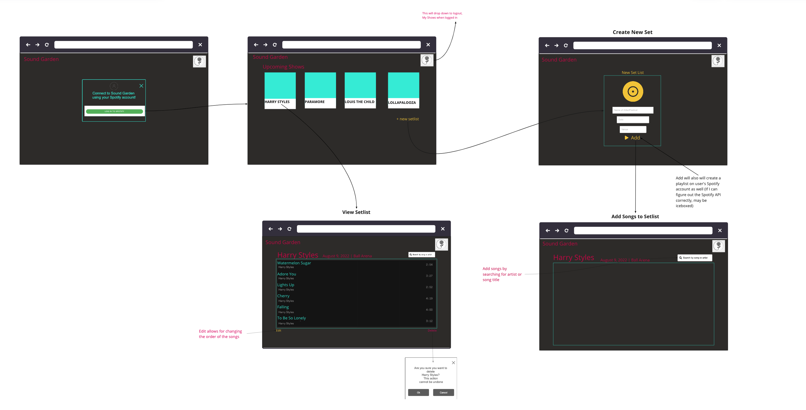
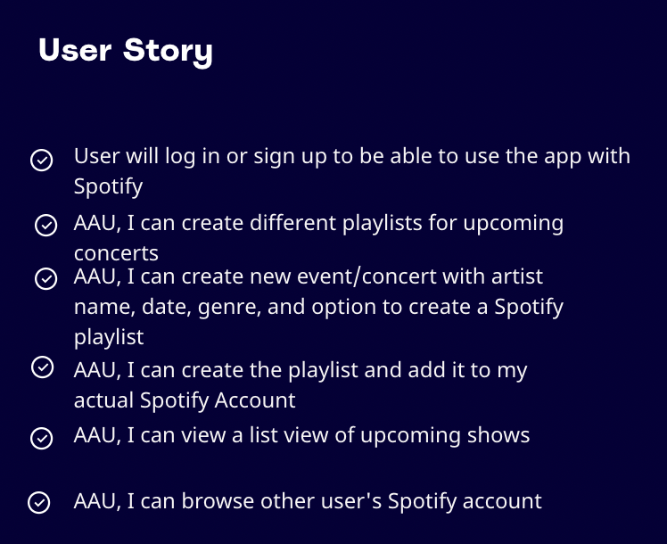
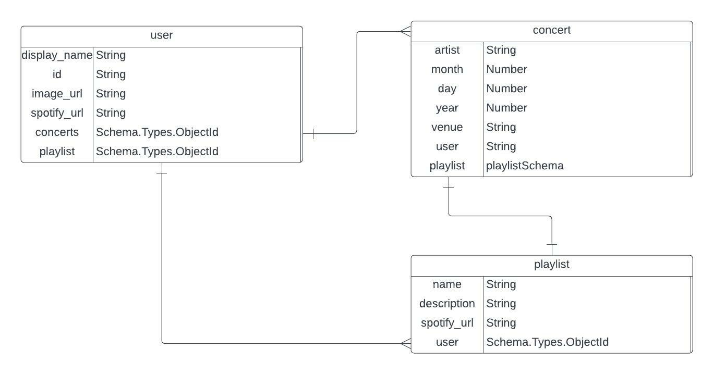

<div id="top"></div>

<!-- [![Contributors][contributors-shield]][contributors-url]
[![Forks][forks-shield]][forks-url]
[![Stargazers][stars-shield]][stars-url]
[![Issues][issues-shield]][issues-url]
[![MIT License][license-shield]][license-url] -->
[![LinkedIn][linkedin-shield]][linkedin-url]


<!-- PROJECT LOGO -->
<!-- <br />
<div align="center">
  <a href="https://github.com/helenamarkus14/soundgarden">
    
  </a> -->

<h3 align="center">Sound Garden</h3>

  <p align="center">
    <br />
    <a href="https://github.com/helenamarkus14/soundgarden"><strong>Explore the docs »</strong></a>
    <br />
    <br />
    <a href="http://thesoundgarden.herokuapp.com/">View App deployed with Heroku</a>
    ·
    <a href="https://github.com/helenamarkus14/soundgarden/issues">Report Bug</a>
    ·
    <a href="https://github.com/helenamarkus14/soundgarden/issues">Request Feature</a>
  </p>
</div>


<!-- TABLE OF CONTENTS -->
<details>
  <summary>Table of Contents</summary>
  <ol>
    <li>
      <a href="#about-the-project">About The Project</a>
      <ul>
        <li><a href="#built-with">Built With</a></li>
      </ul>
    </li>
    <li>
      <a href="#getting-started">Getting Started</a>
      <ul>
        <li><a href="#installation">Installation</a></li>
      </ul>
    </li>
    <li><a href="#usage">Usage</a></li>
    <li><a href="#planning">Planning</a></li>
    <li><a href="#contributing">Contributing</a></li>
    <li><a href="#license">License</a></li>
    <li><a href="#contact">Contact</a></li>
    <li><a href="#acknowledgments">Acknowledgments</a></li>
  </ol>
</details>


<!-- ABOUT THE PROJECT -->
## About The Project

Sound Garden is an application to make playlist currated for upcoming concerts or festivals. Connect with Spotify to create actual playlists on your account. 

<!-- [![Product Name Screen Shot][product-screenshot]](https://example.com) -->

<!-- Here's a blank template to get started: To avoid retyping too much info. Do a search and replace with your text editor for the following: `github_username`, `repo_name`, `twitter_handle`, `linkedin_username`, `email_client`, `email`, `project_title`, `project_description` -->

<p align="right">(<a href="#top">back to top</a>)</p>


### Built With

* [Node.js](https://nodejs.org/)
* [React.js](https://reactjs.org/)
* [Express.js](https://expressjs.com)
* [MongoDB](https://mongodb.com/)
* [SpotifyAPI](https://developer.spotify.com/)
* [TailwindCSS](https://tailwindcss.com/)

<p align="right">(<a href="#top">back to top</a>)</p>


<!-- GETTING STARTED -->
## Getting Started


### Installation

1. Clone the repo
   ```sh
   git clone https://github.com/github_username/repo_name.git
   ```
2. Install Yarn packages
   ```sh
   yarn 
   ```

<p align="right">(<a href="#top">back to top</a>)</p>


<!-- USAGE EXAMPLES -->
## Usage

<!-- code snippets -->


<!-- ROADMAP -->
## Planning

## Wireframes


## User Story

## ERD


See the [open issues](https://github.com/helenamarkus14/soundgarden/issues) for a full list of proposed features (and known issues)


## Future Features

Have a Spotify player to stream music
<!-- CONTRIBUTING -->
<!-- ## Contributing

Contributions are what make the open source community such an amazing place to learn, inspire, and create. Any contributions you make are **greatly appreciated**.

If you have a suggestion that would make this better, please fork the repo and create a pull request. You can also simply open an issue with the tag "enhancement".
Don't forget to give the project a star! Thanks again!

1. Fork the Project
2. Create your Feature Branch (`git checkout -b feature/AmazingFeature`)
3. Commit your Changes (`git commit -m 'Add some AmazingFeature'`)
4. Push to the Branch (`git push origin feature/AmazingFeature`)
5. Open a Pull Request -->


Project Link: [https://github.com/helenamarkus14/soundgarden](https://github.com/helenamarkus14/soundgarden)


<p align="right">(<a href="#top">back to top</a>)</p>


<!-- MARKDOWN LINKS & IMAGES -->
Created by:
Helena Markus
[linkedin-shield]: https://img.shields.io/badge/-LinkedIn-black.svg?style=for-the-badge&logo=linkedin&colorB=555
[linkedin-url]: https://linkedin.com/in/helena-markus 
Denzel Samala
[linkedin-shield]: https://img.shields.io/badge/-LinkedIn-black.svg?style=for-the-badge&logo=linkedin&colorB=555
[linkedin-url]: https://www.linkedin.com/in/dsamala/


<!-- [product-screenshot]: images/screenshot.png -->
